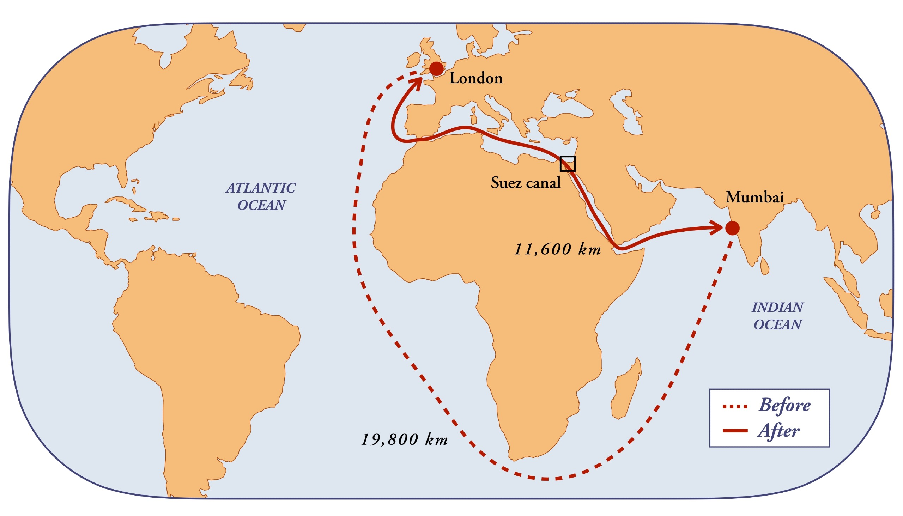
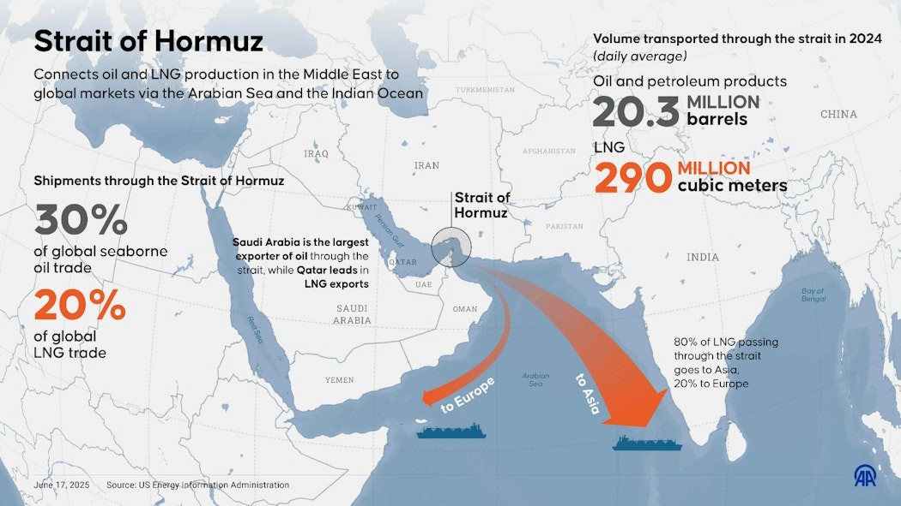
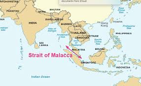

# Trade Shocks and Market Shifts

**Simple summary (for everyone):**  
This project studies how problems in key global sea routes — like the Suez Canal, Panama Canal, and Strait of Hormuz — can make oil prices jump and affect stock markets, especially India’s Nifty sectors. It combines maritime traffic, oil price changes, and financial market reactions.

**Author:** Saurabh Hadole | **Year:** 2025

---

## What is this paper about? (Simple)

Think of the world’s trade routes as highways on the ocean. Most ships follow a few narrow passages. When one of those gets blocked — by war, an accident, or a political crisis — it’s like a global traffic jam. Oil and goods get delayed, prices rise, and stock markets react.  

This research focuses purely on **financial impacts**: short-term oil price spikes, sector-wise Nifty index responses, and recovery patterns.

This research also includes **geopolitical shocks** like the *2021 Suez blockage*, *2022 Russia–Ukraine war*, *2023 Red Sea tensions*, and *2025 Israel–Iran conflict*, which disrupted major chokepoints.

---

## Key Sea Routes (Global Chokepoints)

Below are the most critical global trade passages we studied.

| Route | Map | Description |
|-------|-----|-------------|
| Suez Canal |  | Connects Europe and Asia by linking the Mediterranean Sea to the Red Sea. A blockage delays 12% of world trade. |
| Panama Canal |  | Links the Atlantic and Pacific Oceans — essential for global container trade and U.S.–Asia routes. |
| Strait of Hormuz |  | The world’s most important oil chokepoint — around 20% of global oil passes through here daily. |
| Strait of Malacca |  | Vital route between the Indian Ocean and the South China Sea — key for energy shipments to East Asia. |
| Bab el-Mandeb |  | Connects the Red Sea to the Gulf of Aden. When threatened, ships must reroute around Africa. |
| Cape of Good Hope |  | Used when the Suez route is blocked. Adds thousands of kilometers, raising costs and delivery times. |

---

## Why the Cape of Good Hope Matters

If the Suez Canal or Bab el-Mandeb is blocked, ships detour around southern Africa — the Cape of Good Hope. This longer route increases travel time and fuel cost, causing shipping rates and oil prices to rise. It’s included in this research as a fallback trade path.

---

## What Has Been Done So Far (from Research Notebook)

- **Data collected:** Global oil prices (Brent & WTI), Indian market sector indices (Nifty sectors), and maritime traffic passing through key chokepoints.  
- **Event timeline built:** Major disruptions like Suez blockage, COVID-19 lockdowns, Russia–Ukraine war, Israel–Iran tensions.  
- **Data cleaning:** Standardized oil, market, and traffic datasets into daily formats.  
- **Exploratory analysis:** Visualized how oil, Nifty sectors, and maritime traffic moved before, during, and after events.  
- **Impact measurement:** Quantified short-term oil spikes and Nifty sector declines after chokepoint crises.  
- **Sector correlation analysis:** Measured how Nifty sectors (Energy, Auto, Pharma, Banks, IT) correlated with oil price shocks.  
- **Resilience testing:** Checked recovery speed of sectors post-shock.  
- **COVID-era analysis:** Focused on lockdown effects on oil, maritime traffic, and Nifty sectors.

> **Summary of findings:**  
> - Chokepoint threats spike oil prices sharply.  
> - Energy and transport sectors are hit hardest; Pharma and essential goods recover faster.  
> - Maritime traffic volumes correlate with oil price volatility and sector performance.  
> - COVID-era disruptions showed strong sector-specific vulnerabilities, which inform post-pandemic resilience patterns.

---

## Upcoming Deep-Dive: Geopolitical Events

We are now moving forward to analyze the **financial impact of major geopolitical events** on the Indian market. The events we will study include:

| Date       | Event Description |
|-----------|------------------|
| 2020-03-11 | COVID-19 declared pandemic |
| 2020-04-01 | Global lockdowns begin |
| 2021-03-23 | Suez Canal blockage (Ever Given) |
| 2022-02-24 | Russia-Ukraine War begins |
| 2022-06-05 | Russian oil sanctions implemented |
| 2023-07-01 | Panama Canal drought restrictions |
| 2023-10-07 | Red Sea attacks begin |
| 2024-01-12 | US/UK strikes in Yemen |
| 2025-06-22 | US bombing of Iranian nuclear facility |

We will **dive deep into these events**, examining:

- The **impact on Indian Nifty sectors** (Energy, Banks, Pharma, IT, Auto).  
- **Oil price shocks** caused by maritime chokepoint disruptions.  
- **Sectoral resilience and recovery patterns** post-event.  
- Correlation with **maritime traffic and trade flow disruptions**.

This analysis will quantify **how global geopolitical crises translate into financial shocks in India**, enabling better risk assessment and investment planning.

---

## How the Analysis Works (Step-by-Step)

1. **Identify events:** Exact dates of global trade disruptions and geopolitical crises.  
2. **Compare data:** Oil, Nifty sector indices, and maritime traffic before, during, and after events.  
3. **Measure reactions:** Percentage changes, time to recovery, and correlation across sectors.  
4. **Repeat across chokepoints:** Identify consistent financial patterns and outliers.  
5. **COVID-era reference:** Compare pre-COVID, lockdown, and post-lockdown periods to separate pandemic effects from geopolitical shocks.

---

## Why This Matters

Modern economies rely on maritime chokepoints. When blocked:  

- Energy costs rise.  
- Inflation and market volatility increase.  
- Sector-specific investment risks appear.  

Understanding this helps investors, companies, and policymakers plan better: building reserves, diversifying trade routes, or investing in resilient sectors.

---

## How to Add Your Images

Replace sample paths like:

```markdown

